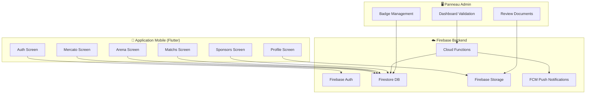
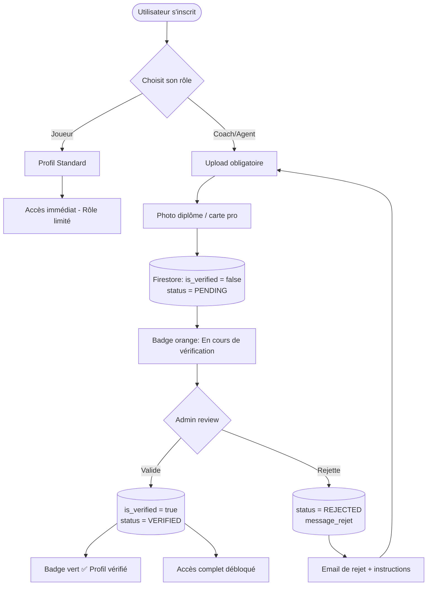

# Architecture ProDay — Documentation Technique

> Sources Mermaid exportables : `assets/diagrams/architecture.mmd`, `verification-flow.mmd`, `navigation.mmd`

## 1. Diagramme d'architecture globale



## 2. Workflow de validation des profils



## 3. Modèle de données Firestore

```
users/
  {uid}/
    displayName: string
    email: string
    role: "player" | "coach" | "agent" | "organizer" | "sponsor"
    is_verified: boolean
    status: "PENDING" | "VERIFIED" | "REJECTED"
    created_at: timestamp
    location: GeoPoint
    
    profile/
      position?: string          // joueur
      category?: string          // U15, U19, Seniors...
      level?: string             // R1, N3, Pré-national...
      diploma?: string           // coach: BEF, BFF...
      license_number?: string    // agent
      club_id?: string
      
    documents/
      {docId}/
        type: "diploma" | "license" | "id"
        storage_url: string
        uploaded_at: timestamp
        reviewed_at?: timestamp

clubs/
  {clubId}/
    name: string
    city: string
    location: GeoPoint
    logo_url: string
    verified: boolean
    categories: string[]
    sponsor_ids: string[]

tournaments/
  {tournamentId}/
    name: string
    organizer_id: string
    location: GeoPoint
    date_start: timestamp
    date_end: timestamp
    categories: string[]
    status: "OPEN" | "IN_PROGRESS" | "FINISHED"
    
    teams/
      {teamId}/
        club_id: string
        players: string[]        // array of user UIDs
    
    matches/
      {matchId}/
        team_a: string
        team_b: string
        score_a: number
        score_b: number
        phase: "poule" | "quart" | "demi" | "finale"
        
    awards/
      best_player: string        // UID
      top_scorer: string         // UID
      best_goalkeeper: string    // UID

friendly_matches/
  {matchId}/
    requester_club_id: string
    location: GeoPoint
    date: timestamp
    category: string
    level: string
    status: "OPEN" | "ACCEPTED" | "PLAYED"
    opponent_club_id?: string

sponsor_offers/
  {offerId}/
    company_name: string
    logo_url: string
    offer_type: "equipment" | "money" | "visibility"
    description: string
    value: string
    target_categories: string[]
    city: string
```

## 4. Contrats Cloud Functions

### `onProfileSubmit` — Déclenché à l'upload d'un document
```typescript
// Trigger: Firestore write on users/{uid}/documents/{docId}
// Action: Notifie l'admin, set status = PENDING
```

### `onProfileValidated` — Déclenché par l'admin
```typescript
// Trigger: HTTP callable (admin panel)
// Input: { uid: string, action: "approve" | "reject", message?: string }
// Action: Update is_verified, send push notification to user
```

### `onTournamentCreated` — Géofencing agents
```typescript
// Trigger: Firestore write on tournaments/{id}
// Action: Query agents within 50km radius → send FCM push notification
```

### `onMatchFinished` — Awards notification
```typescript
// Trigger: HTTP callable (organizer)
// Input: { tournamentId, bestPlayer, topScorer, bestGoalkeeper }
// Action: Send push to all tournament subscribers
```

## 5. Règles de sécurité Firestore (extrait)

```javascript
rules_version = '2';
service cloud.firestore {
  match /databases/{database}/documents {
    
    // Un utilisateur lit/modifie uniquement son propre profil
    match /users/{userId} {
      allow read: if request.auth != null;
      allow write: if request.auth.uid == userId;
    }
    
    // Seul un admin peut changer is_verified
    match /users/{userId} {
      allow update: if request.auth.token.admin == true 
                    || (request.auth.uid == userId 
                        && !request.resource.data.diff(resource.data).affectedKeys()
                           .hasAny(['is_verified', 'status']));
    }
    
    // Un coach non-vérifié ne peut pas envoyer de message
    match /messages/{msgId} {
      allow create: if request.auth != null 
                    && get(/databases/$(database)/documents/users/$(request.auth.uid))
                       .data.is_verified == true;
    }
  }
}
```
